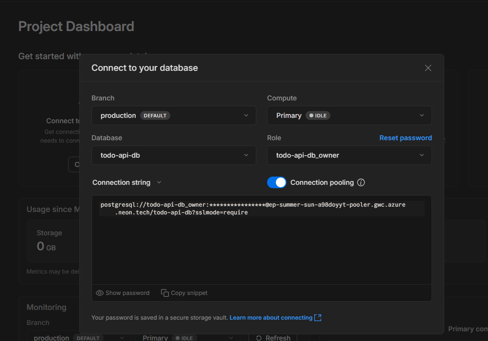
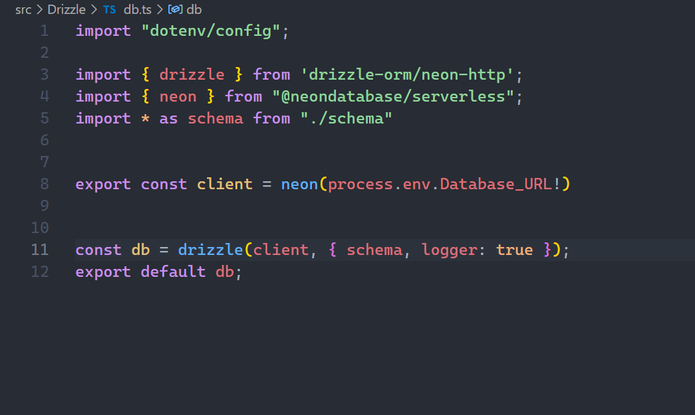
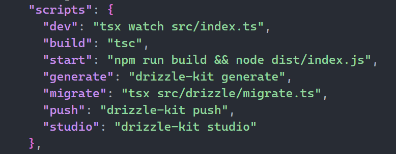

# Deploying PostgreSQL from Local to Neon with Drizzle ORM

## What is Neon?

[Neon](https://neon.tech/) is a serverless, fully managed PostgreSQL platform built for the cloud. It offers features like instant branching, autoscaling, and a modern developer experience. Neon is ideal for projects that need scalable, cloud-native PostgreSQL without the hassle of managing infrastructure.

---

## Local Development Setup

Previously, you may have used [pgAdmin4](https://www.pgadmin.org/) to manage your local PostgreSQL server for development. Your application connected to this local database for all operations.

---

## Migrating to Neon

To move your database from local to Neon, follow these steps:

### 1. Create a Neon Account and Database

- Go to [Neon Console](https://console.neon.tech/) and sign up.
- Create a new project and database.
- Copy the provided **connection string** (you'll need this for your `.env` file).



---

### 2. Update Your Codebase

Install [`@neondatabase/serverless`](https://www.npmjs.com/package/@neondatabase/serverless)

Update your database connection in [`src/Drizzle/db.ts`](src/Drizzle/db.ts):

```typescript
import { neon } from "@neondatabase/serverless";
export const client = neon(process.env.Database_URL!)
```



Make sure your `.env` file contains the Neon connection string:

```
Database_URL=your-neon-connection-string
```

---

### 3. Migrate Your Schema to Neon

Add the scripts to migrate your schema:



- Use [Drizzle Kit](https://orm.drizzle.team/docs/overview) to push your schema to Neon:

  ```bash
  pnpm push
  ```

  This runs the script:

  ```json
  "push": "drizzle-kit push"
  ```
- To open Drizzle Studio in your browser for live database management:

  ```bash
  pnpm studio
  ```

---

### 4. Best Practices

- Always back up your local database before migrating.
- Use environment variables to manage sensitive connection strings.
- Test your application thoroughly after migration.

---

## Example Workflow

1. **Sign up and create a Neon database.**
2. **Update your `.env` with the Neon connection string.**
3. **Run migrations:**
   ```bash
   pnpm push
   ```
4. **Open Drizzle Studio (optional):**
   ```bash
   pnpm studio
   ```

---

## Resources

- [Neon Documentation](https://neon.tech/docs/introduction)
- [Drizzle ORM Docs](https://orm.drizzle.team/docs/overview)
- [@neondatabase/serverless on npm](https://www.npmjs.com/package/@neondatabase/serverless)

---

Enjoy serverless PostgreSQL with Neon!
